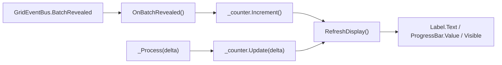

# Combo System 设计

> 状态：已定型（2026-08-10）
> 分层约定见 `.github/skills/layered-architecture`。

## 背景

连击机制——连续成功操作提升等级（Good/Great/Excellent），时间流逝逐级衰减。
现有 `ComboComponent`（Godot Node）把纯逻辑和表现混在一个场景脚本里，无法单元测试。
目标：把组合逻辑抽成纯逻辑 Core 组件，用 TDD 驱动，不过度工程化。

## 分层决策

- **Layer 1（纯逻辑）**：`SnekSweeperCore/ComboSystem/`，零 Godot 依赖，完全可测。
- **Layer 3（Godot 表现）**：`SnekSweeper/Scripts/Combo/ComboRankCard.cs`，自包含场景脚本，唯一 Godot 文件。
- **不用 FSM**：计数器 + 连续时间维度是弱 FSM 场景，FSM 只换皮不产生杠杆；等出现真正 per-state 行为差异时再评估（届时可考虑 Stateless 或保持现有 LogicBlocks 生态）。

## Layer 1 — `SnekSweeperCore/ComboSystem/`

### `ComboConfig` — `sealed record`

显式构造器验证（对齐 `ScrollMenuConfig` 风格，非法配置在构造时拒绝）：

- `maxLevel >= 2`（否则无法达到 Good/Great/Excellent 段位），否则 `throw ArgumentException`
- `decayInterval > 0`（否则除零/NaN），否则 `throw ArgumentException`
- 属性只读：`int MaxLevel`、`float DecayInterval`
- `public static ComboConfig Default => new();`

### `ComboCounter(ComboConfig config)` — `sealed class`，primary constructor

| 成员 | 说明 |
|---|---|
| `int Level` | 当前等级 0..MaxLevel |
| `float ProgressRatio` | 1→0 连击槽剩余比例，用于 ProgressBar |
| `void Update(float deltaTime)` | 每帧调用；clamp 负 delta；while 跨多间隔衰减；level 归 0 时 elapsed 归零 |
| `void Increment()` | 成功操作；重置 elapsed、level+1 并 clamp 到 MaxLevel |
| `void Reset()` | 归零 |
| `static ComboTier GetTier(int)` | level → tier 映射（None/Good/Great/Excellent） |

### `ComboTier` — `enum`

`None, Good, Great, Excellent`

> 显示字符串（"Good"/"Great"/"Excellent"）**不放在 Core**，映射移到 Godot 层，便于将来 i18n。

## Layer 3 — `SnekSweeper/Scripts/Combo/ComboRankCard.cs`

`ComboRankCard : VBoxContainer, ISceneScript`（自包含，合并原 ComboComponent + 原 ComboRankCard）：

- AutoInject：`[Dependency] LevelData`，`OnResolved` 订阅 `GridEventBus.BatchRevealed`
- `_Ready`：检查 `HouseKeeper.MainSetting.ComboRankDisplay`，为 false 则 `Hide()`；否则 `new ComboCounter(ComboConfig.Default)`
- `_Process`：`_counter.Update((float)delta)` + `RefreshDisplay()`
- `OnBatchRevealed`：`_counter.Increment()` + `RefreshDisplay()`
- `RefreshDisplay`：`tier → text`、`ProgressRatio → ProgressBar.Value`、`Visible = tier != None`

### 数据流

### 文件变更

| 操作 | 文件 |
|---|---|
| 新增 | `SnekSweeperCore/ComboSystem/ComboConfig.cs`、`ComboCounter.cs`、`ComboTier.cs` |
| 改写 | `SnekSweeper/Scripts/Combo/ComboRankCard.cs`、`ComboRankCard.tscn`（移入 Label/ProgressBar） |
| 删除 | `ComboComponent.cs/.tscn`、`IComboDisplay.cs`、`BasicComboDisplay.cs` |

## 关键语义

- **ProgressRatio 方向**：1 = 刚 Increment（满槽），0 = 即将衰减/无连击（空槽）；对齐原始 `TimeLeft / WaitTime`。
- **level 归 0 时 ProgressRatio = 0**（空槽，非满槽）——连击彻底消失后没有"即将衰减"可言（对齐太刀气刃槽语义）。

## 测试约定 — `tests/BasicTests/ComboTests/ComboCounterTests.cs`

- 框架：TUnit（`[Test]` 来自全局 `using TUnit.Core`，无需手动 using）
- 断言：**AwesomeAssertions**（`using AwesomeAssertions`）；int 用 `.Be()`，float 用 `.BeApproximately()`
  - 精确状态（elapsed=0 / level=0 分支）→ `DefaultTinyTolerance = 1e-6f`
  - 计算比例（除法结果，如 0.5 / 0.002）→ `0.01f`
- 纯同步逻辑 → 测试方法用 **`void`**（不用 async Task）
- 构造配置：test-local `CreateCounter(int maxLevel = 4, float decayInterval = 5f)` 工厂，默认值在签名中显式可见
- 构造验证测试：`Func<ComboConfig> act = () => new ComboConfig(decayInterval: 0f);` 后 `act.Should().Throw<ArgumentException>()`

## 待办 / 未决项

- [x] `GetTier` 字符串映射（`ToDisplayText`）移到 Godot 层
- [x] `ComboRankCard.tscn` 节点结构调整（移除 GridComboComponent 实例 + PackedScene 引用，Label/ProgressBar 原位保留）
- [x] 旧文件删除（`ComboComponent`、`IComboDisplay`、`BasicComboDisplay` 及其 `.uid`）
- [ ] 在 Godot 编辑器中打开 `HUD.tscn` / `ComboRankCard.tscn` 做最终视觉确认
- [ ] i18n 落地时：Core 保持 tier 枚举不变，仅改 Godot 层映射
