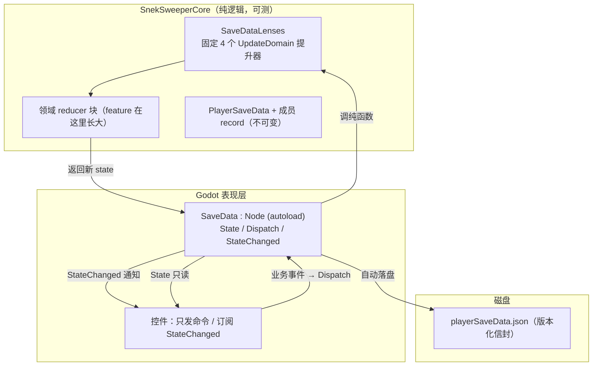

# SaveData Functional Architecture（目标设计）

> **状态：设计决策已确认，尚未落地。**
> ⚠️ 本文档描述的领域模型均为 **record 化完成后的目标形态**，而 record 化（B 阶段）是下一步真正要做的工作。当前代码中 `MainSetting` / `ActivatedCheatCodeSet` / `CurrentRunInfo` / `History` 仍是可变 class。

## 1. 背景与动机

原 `PlayerSaveData` 的 4 个成员是可变 class，通过 `HouseKeeper` static 单例暴露，消费端直接改引用内部状态（`HouseKeeper.MainSetting.X = v`、`history.AddRecord(...)`），落盘靠各调用点手动 `TriggerPlayerDataSave()`（散落在 5 处）。

改造目标：**不可变状态 + 单向数据流 + 事件驱动保存**，并最终让 `MainSetting` 等通过 DI 注入场景（E 阶段，最初动机）。

## 2. 目标架构分层



**读**：所有人只读 `SaveData.State`（或订阅 `StateChanged`）。
**写**：所有人只发命令 → `Dispatch` → lens 提升器 → 领域 reducer → 新 state → 通知 + 自动保存。
**纯逻辑在 Core**；`SaveData` 只是 Godot 薄壳（生命周期 / 落盘 / DI）。

## 3. 关键决策（ADR）

### 决策 1：领域模型 record 化（B 阶段，前置条件，尚未完成）

`PlayerSaveData` 及其 4 个成员全部改为不可变 record，集合成员用 `ImmutableHashSet` / `ImmutableList`（BCL 自带，`Add`/`Remove` 返回新实例且结构共享）。

```csharp
public record PlayerSaveData(
    MainSetting MainSetting,
    ActivatedCheatCodeSet ActivatedCheatCodeSet,
    CurrentRunInfo CurrentRunInfo,
    History History);

public record MainSetting(
    GridDifficultyKey CurrentDifficultyKey = GridDifficultyKey.Intermediate,
    SkinKey CurrentSkinKey = SkinKey.Classic,
    bool ComboRankDisplay = true,
    bool GenerateSolvableGrid = true);

public record ActivatedCheatCodeSet(ImmutableHashSet<CheatCodeKey> ActivatedSet)
{
    public static ActivatedCheatCodeSet Empty { get; } = new(ImmutableHashSet<CheatCodeKey>.Empty);
    public ActivatedCheatCodeSet Add(CheatCodeKey key) => this with { ActivatedSet = ActivatedSet.Add(key) };
    public ActivatedCheatCodeSet Remove(CheatCodeKey key) => this with { ActivatedSet = ActivatedSet.Remove(key) };
    public bool Contains(CheatCodeKey key) => ActivatedSet.Contains(key);
}

public record CurrentRunInfo(GridSnapshot? GridSnapshot = null, RunStartInfo? StartInfo = null);

public record History(ImmutableList<GameRunRecord> Records)
{
    public static History Empty { get; } = new(ImmutableList<GameRunRecord>.Empty);
    public History Add(GameRunRecord record) => this with { Records = Records.Add(record) };
    public History Clear() => this with { Records = Records.Clear() };
}
```

### 决策 2：领域 reducer 按子状态拆分（不集中在 aggregate 上）

所有 reducer **不**堆在 `PlayerSaveData` 上，而是每个子状态在自己领域文件里开 `extension` 块（C# 14），与领域记录共址、独立增长、独立测试。命名遵循 immutable 语义：用 `With*` / `Add` / `Clear`（Immutable 集合惯用动词），**避免 `Set*`**（听起来像原地修改）。

```csharp
// GameSettings/MainSettingReducers.cs —— 只有 MainSetting 的事
public static class MainSettingReducers
{
    extension(MainSetting setting)
    {
        public MainSetting WithComboRankDisplay(bool value) => setting with { ComboRankDisplay = value };
        public MainSetting WithDifficulty(GridDifficultyKey key) => setting with { CurrentDifficultyKey = key };
        // 新 feature 只加这里，聚合层不动
    }
}

// GameHistory/HistoryReducers.cs —— 只有 History 的事
public static class HistoryReducers
{
    extension(History history)
    {
        public History Add(GameRunRecord record) => history with { Records = history.Records.Add(record) };
        public History Clear() => history with { Records = ImmutableList<GameRunRecord>.Empty };
    }
}
```

`ActivatedCheatCodeSet.Add/Remove` 直接在 record 上（见决策 1），`CurrentRunInfo` 同理。

### 决策 3：聚合层 = 固定 4 个 `UpdateDomain` 提升器（lens），不随 feature 增长

`dispatch(s => s.Domain.WithX(x))` 的核心障碍：子 reducer 返回子状态而非整个 `PlayerSaveData`，必须有一层把子状态变化抬回聚合状态。这层 lift 用 **每领域一个** 的 `UpdateDomain` 实现，**数量固定为 4，永不随 feature 增长**（等价于把泛型 lens 硬编码成具体方法，但 IntelliSense 可发现）。

```csharp
// SaveLoad/SaveDataLenses.cs —— 固定 4 个，永远只有 4 个
public static class SaveDataLenses
{
    extension(PlayerSaveData state)
    {
        public PlayerSaveData UpdateMainSetting(Func<MainSetting, MainSetting> reduce) =>
            state with { MainSetting = reduce(state.MainSetting) };

        public PlayerSaveData UpdateActivatedCheatCodeSet(Func<ActivatedCheatCodeSet, ActivatedCheatCodeSet> reduce) =>
            state with { ActivatedCheatCodeSet = reduce(state.ActivatedCheatCodeSet) };

        public PlayerSaveData UpdateCurrentRunInfo(Func<CurrentRunInfo, CurrentRunInfo> reduce) =>
            state with { CurrentRunInfo = reduce(state.CurrentRunInfo) };

        public PlayerSaveData UpdateHistory(Func<History, History> reduce) =>
            state with { History = reduce(state.History) };
    }
}
```

三种形态对比（已选中间）：

| 形态 | 聚合层方法数 | feature 增长时 |
|---|---|---|
| 全量 facade | N（每个 feature 一个） | 聚合层 +1 |
| **UpdateDomain 提升器（选定）** | **固定 4（每领域一个）** | **聚合层不动**，只加领域块 |
| 纯泛型 lens | 4 个 lens 常量 | 聚合层不动 |

### 决策 4：`SaveData` autoload = 唯一入口 + 事件驱动保存

`HouseKeeper` 的 static 可变仓库替换为 `SaveData : Node` autoload。`Dispatch` 内部才调 reducer、才替换 `_state`、才通知 + 保存——**单一写入者**，保证"每次状态变更必通知、必落盘"。

```csharp
// Autoloads/SaveData.cs
public partial class SaveData : Node
{
    public static SaveData Instance { get; private set; } = null!;

    PlayerSaveData _state = null!;
    public PlayerSaveData State => _state;
    public event Action<PlayerSaveData>? StateChanged;

    public override void _Ready()
    {
        Instance = this;
        _state = LoadOrCreate();
    }

    public void Dispatch(Func<PlayerSaveData, PlayerSaveData> reduce)
    {
        var next = reduce(_state);
        if (ReferenceEquals(next, _state)) return;   // 无变化（reducer 对 no-op 直接返回原引用）
        _state = next;
        StateChanged?.Invoke(_state);     // ① UI 订阅刷新
        _ = PersistAsync(_state);         // ② 事件驱动保存（替换所有手动 Trigger）
    }

    public void SaveNow() => _state.Save(OS.GetUserDataDir());   // 退出兜底（QuitHandler）
}
```

### 决策 5：落盘触发点收敛

现状 5 处手动触发全部删除：`Level1._ExitTree`、`SettingsPage`、`CheatCodePage`、`HistoryPage` 里的 `TriggerPlayerDataSave()`；`QuitHandler` 改为调用 `SaveData.SaveNow()`（退出兜底保留，因为退出时无法做异步保存）。

### 决策 6：E 阶段（DI，最初动机）

record 化 + 单一入口之后，`SaveData` 成为可注入服务（像 `ISceneSwitcher` / `IAppRepo`），场景里 `Get<SaveData>()` 注入，彻底告别 static 单例。`MainSetting` 只是 `SaveData.State.MainSetting` 的普通字段，不再需要像 `currentSkin` 那样特殊处理。

### 决策 7：放弃 C2（领域直接序列化）——仅生命末期才考虑

**决策（2026-08-29）**：不做"领域 record 直接 `[MemoryPackable]`、删 DTO+Mapperly"。理由：

- C2 只省一个"当前版本 DTO"，却付出三笔代价：
  1. **每个新版本都要做"冻结转换"**：当前设计里每个版本生来就是 DTO，冻结 = "不再修改"，零转换；C2 则每次要把当前 domain 手动复制成冻结 DTO。
  2. **DTO 与 domain 混层**：迁移层同时存在"历史 = DTO、当前 = domain"两种 schema 类型；当前设计只有一种（全 DTO），domain 纯净。
  3. **序列化约束泄漏进 domain**：domain 直接 `[MemoryPackable]` 要处理 `ImmutableHashSet`/`ImmutableList` 等 MemoryPack 不原生支持的类型。
- 当前设计的 DTO 层成本本来就低：Mapperly 自动生成映射（B 阶段全程零改动）、DTO 是薄类型、冻结免费。
- **保留**：版本化信封 + 每版本一个冻结 DTO + 最新 DTO→Mapperly→domain 的分离形态。**仅当确认永远不再出新存档版本（游戏定稿）时**，才可把当前 DTO 折叠进 domain 作为终局简化。

## 4. 调用形态（消费端）

```csharp
// 设置（ComboRankToggle / DifficultySelect / SkinSelect / GenerateSolvableGridToggle）
SaveData.Dispatch(s => s.UpdateMainSetting(m => m.WithComboRankDisplay(toggledOn)));

// 作弊码（CheatCodeCard / HumbleGrid）
SaveData.Dispatch(s => s.UpdateActivatedCheatCodeSet(a => a.Add(_cheatCode.Key)));
// 注意：CheatCodeCard 现在构造时缓存 _activatedCheatCodeSet 字段的问题由不可变状态天然消除

// 进行中的局（GameRunRecorder → 变纯函数，不持有引用）
SaveData.Dispatch(s => s.UpdateCurrentRunInfo(r => r.WithGridSnapshot(snapshot)));
SaveData.Dispatch(s => s.UpdateHistory(h => h.Add(recentRecord)));

// 历史（HistoryPage 清空）
SaveData.Dispatch(s => s.UpdateHistory(h => h.Clear()));

// 只读（AppRepo / MainMenuContainer / Level1.NewGame）
SaveData.State.MainSetting.CurrentSkinKey.ToSkin();
```

可选的进一步收敛（省掉 `s =>`，在 `SaveData` 上转发，纯逻辑仍在 Core 可测）：
```csharp
public void UpdateMainSetting(Func<MainSetting, MainSetting> reduce) =>
    Dispatch(s => s.UpdateMainSetting(reduce));
// 调用：SaveData.UpdateMainSetting(m => m.WithComboRankDisplay(v));
```

## 5. 测试策略

reducer 是纯函数，`BasicTests` 直接测：领域块测"新状态正确 + 原状态不变"；提升器测 lift 正确。

```csharp
[Test]
public void add_record_returns_new_state_and_keeps_original_untouched()
{
    var s = PlayerSaveData.CreateEmpty();
    var next = s.UpdateHistory(h => h.Add(someRecord));
    next.History.Records.Should().Contain(someRecord);
    s.History.Records.Should().BeEmpty();
}
```

## 6. 完成状态（B/D/E 全部落地，2026-08-28）

1. **B 阶段 ✅**：`MainSetting` / `ActivatedCheatCodeSet` / `CurrentRunInfo` / `History` 全部 record 化（不可变 + Immutable 集合），Mapperly 全程零改动。
2. **D 阶段 ✅**：
   - `SaveDataLenses`（4 个 UpdateDomain 提升器）+ `SaveData` autoload（Dispatch/StateChanged/SaveQueue 事件驱动保存）。
   - `GameRunRecorder` 重构：收敛为单 `ISaveDataStore` 依赖 + `FinishRun` 复合方法（清快照+生成记录+入库，返回记录）；`GameRunRecord.FromRun` 纯函数；删 `GenerateRecentRecord`/`SaveRecord`/`ClearSnapshot`。
   - 保存视觉反馈：`ISaveDataStore.NotifySaved()`/`SavedFeedback` + 组合根订阅 toast。
3. **E 阶段 ✅**：`Main` `IProvide<ISaveDataStore>`；消费端 `[Dependency] ISaveDataStore SaveData` 注入（读 State / 写 UpdateX 扩展 / CurrentSkin 派生查询），`SaveData` 只剩 `Instance` static；AppRepo 简化为纯 app 事件持有者。
4. **C2（已放弃）**：见决策 7——领域直接序列化不采纳，保持"DTO 层版本化 + domain 纯净"。

## 7. 关联决策（已完成，本方案依赖）

- **版本化迁移链**：JSON `{version, data}` + 二进制 `BinarySaveEnvelope`，`SaveFormat` 双策略，共享纯逻辑 `SaveMigrations`。
- **`GridSnapshot.SnapshotStates` 为 2D**（c1.2），`SaveVersion.Current = 2`。
- **JSON 2D 矩阵转换器**：`Matrix2DConverter<T>` 抽象基类 + `Mat2DConverter` / `CellSnapshotState2DConverter`，位于 `SaveLoad/CustomJsonConverter/`；`HandleNull => false` 在边界拒绝 null（make invalid state unrepresentable）；`JaggedIntArrayConverterHolder` 为非泛型静态缓存（避免 CA1000）。
